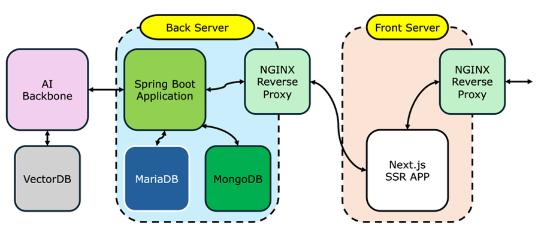
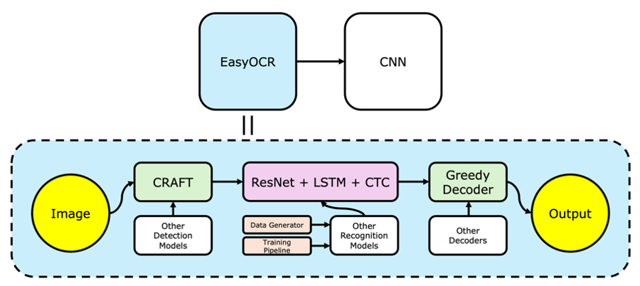

# 연산군 (Calcking)

## :rainbow: Project Overview

### Project Name

연산군 (Calcking)

### Abstract

연산 학습지 플랫폼  
초등학교 수준의 사칙 연산 학습지를 생성하고, 답지 제공, AI 정답 채점 및 학습자의 오답을 자세하게 분석하고, 학습자에게 부족한 부분을 피드백 함.

### Development Motivation & Necessity

교육현장에서 기존 연산 학습지 플랫폼의 불편한 사용성.

> e.g. 여러 장으로 출력하는 기능을 지원하지 않아 학습지를 제공할 때 교육자가 일일이 편집 해야 하여 시간 사용이 효율적이지 못함.

교육자의 학습자 연산 실력 분석 및 판단을 보강할 시스템 필요.

> e.g. 교육자가 학습자의 연산 실력을 분석하고 판단할 때, 교육자 본인의 감과 경험에 의존하기 때문에 오차가 있을 수 있음. 그로 인하여 학습자가 교육자의 판단에 휘둘리기 쉬움. 교육자의 판단을 보강할 시스템이 필요함.

교육자의 부재 시, 학습자 자기 주도 학습 시스템 필요.

> e.g. 교육자가 장기간 부재 중일 경우, 교육자가 채점이나 피드백 등을 할 수 없기 때문에, 학습자 혼자서도 채점을 하고, 피드백을 받을 수 있는 시스템이 필요.

 

## :zap: Project Architecture

### Web Architecture

### AI(OCR) Architecture

 

## :seedling: Project Proposal

### Presentation Materials (Korean)

[Presentation Link (Only See)](https://1drv.ms/p/s!Aiuea30kcZTlhtM2FtmwnpRjdra9mQ?e=jePmbA)

 

## :evergreen_tree: Project Result

### Presentation Materials (Korean)

[Presentation Link (Only See)](https://1drv.ms/p/s!Aiuea30kcZTlh7F4Ya0nsiQ5hihWRA?e=HJKOuO)

### Report (Korean)

[Report Link (Only See)](https://1drv.ms/b/s!Aiuea30kcZTlh7J59wuCFrC__zeH8Q?e=mMcOFi)

### Demo (Korean)

[YouTube Link](https://youtu.be/0SeQxC8DgdU)

 

## :link: Project GitHub Links

### Back-end

> https://github.com/KibleLab/calcking-be

### AI(Score)

> https://github.com/KibleLab/calcking-ai-score

 

## :smile: Introduce Team Member

### 이현준

팀장, Web 총괄  
프로젝트 기획 및 일정 관리  
UI Design 및 Prototyping  
Server Engineering, Resource 관리  
**E.** registry.forbiz@gmail.com  
**G.** https://github.com/RegistryROK

### 김준기

부팀장, AI 총괄  
Prompt Engineering  
데이터 수집 및 라벨링  
관련 논문 및 프로젝트 리서치 및 평가  
**E.** rwr9857@naver.com  
**G.** https://github.com/Vulpes94

### 최호연

팀원, Back-end 개발, Resource 지원  
**E.** choihy2k@gmail.com

### 한지석

팀원, Front-end 개발  
**E.** choihy2k@gmail.com
